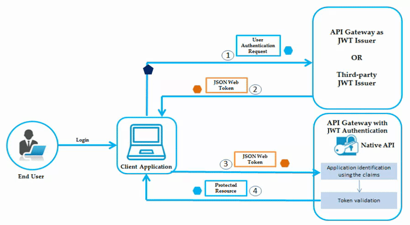
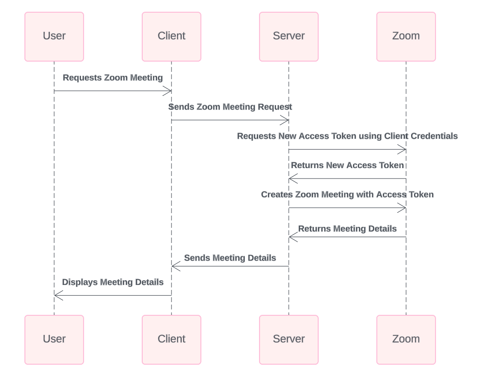
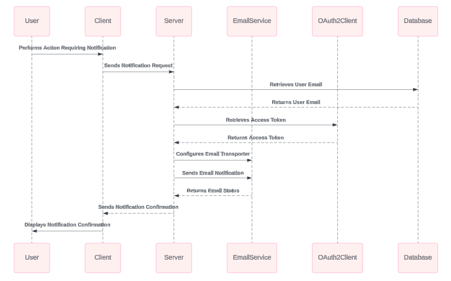
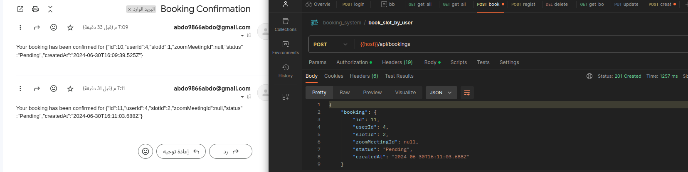
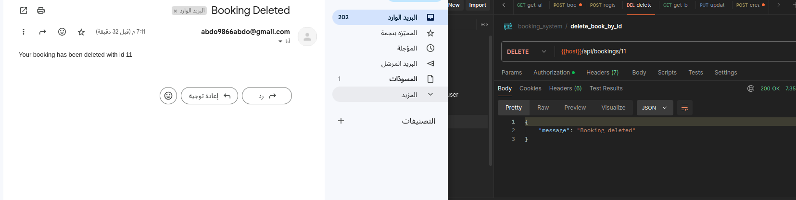
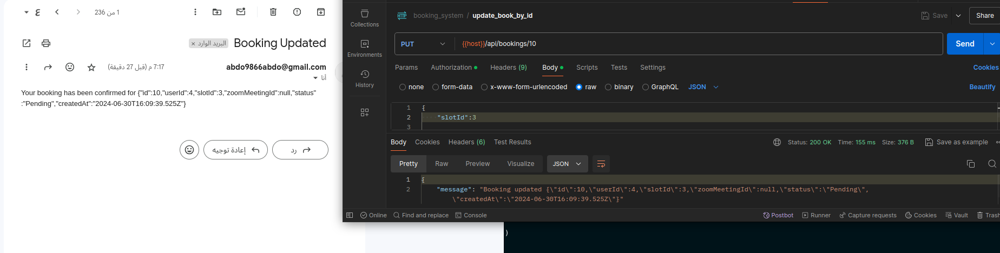
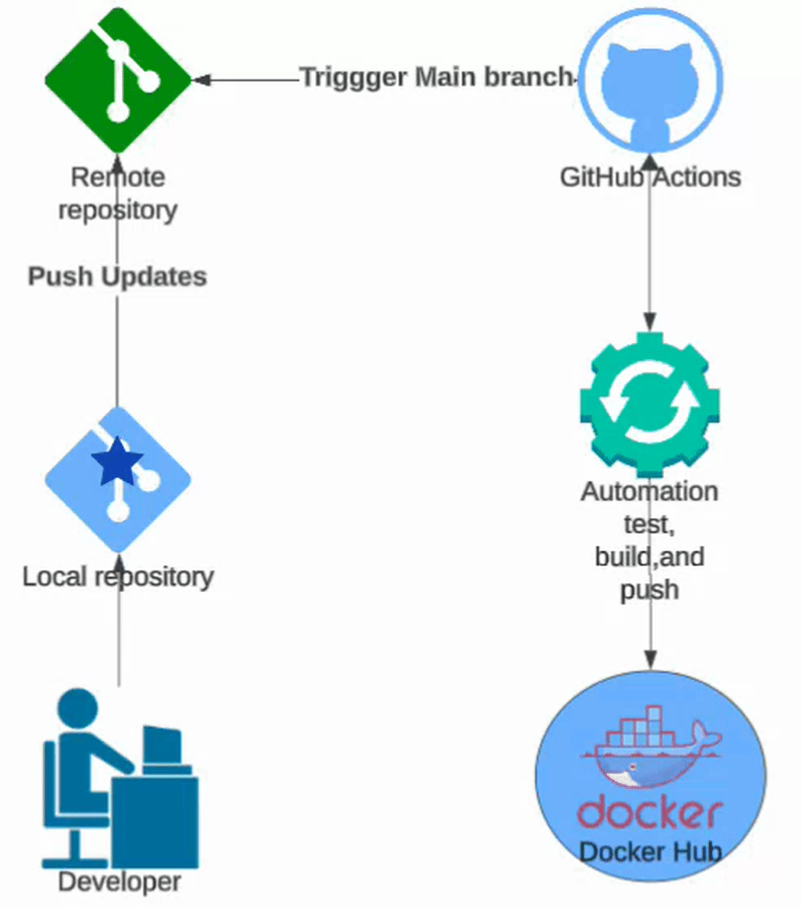
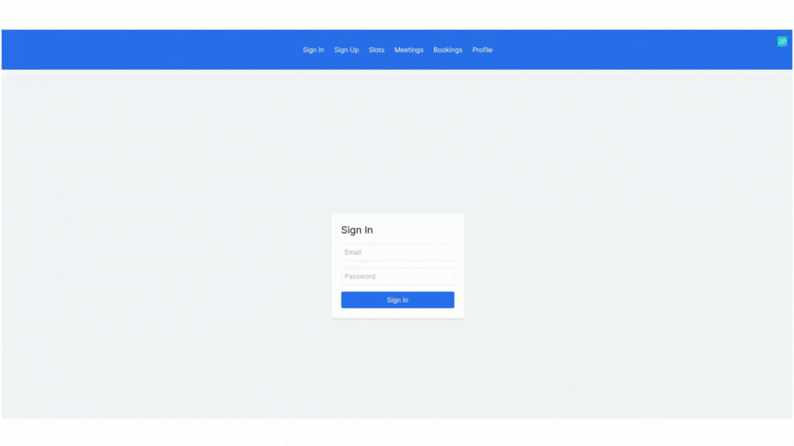

# Booking System

## Table of Contents

1. [Introduction](#introduction)
2. [Usage](#usage)
3. [Database](#database)
4. [JWT Authentication](#jwt-authentication)
5. [Zoom Integration](#zoom-integration)
6. [Email Notification](#email-notification)
7. [Search Functionality](#search-functionality)
8. [Testing and Postman Documentation](#testing-and-postman-documentation)
9. [Environment Variables](#environment-variables)
10. [Docker Compose](#docker-compose)
11. [CI/CD](#ci-cd)
    - [Docker Hub](#docker-hub)
    - [Vercel](#vercel)


## Introduction

The Booking System allows users to:
- Book slots easily and efficiently.
- Manage meetings and bookings.
- Receive notifications about upcoming events.
- Search and filter available slots.
- Integrate with Zoom for virtual meetings.

## Usage

### Running the Application

1. **Clone the repository:**
    ```bash
    git clone https://github.com/your-repo/booking-system.git
    cd booking-system
    ```

2. **Install dependencies:**
    ```bash
    npm install
    ```

3. **Set up environment variables:** 
    Create a `.env` file in the root directory and add the required environment variables. Refer to the [Environment Variables](#environment-variables) section for the details.

4. **Run the application:**
    ```bash
    npm run dev
    ```

### Booking a Slot

1. **Access the application** in your browser at `http://localhost:3000`.

2. **Log in or register** to access the booking system.

3. **Navigate to the booking page** and select the desired slot.

4. **Confirm your booking**. You will receive a confirmation email if the process is successful.

## Database

The system uses PostgreSQL as the database. Below is the Entity-Relationship Diagram (ERD) for the database schema:

<p align="center">

</p>

## JWT Authentication

### General Overview

JSON Web Tokens (JWT) are used for securely transmitting information between the client and server.

<p align="center">

</p>

### Sequence Diagram for JWT Process

The following sequence diagram illustrates the JWT authentication flow:

<p align="center">
    
</p>

## Zoom Integration

The system integrates with Zoom to schedule virtual meetings. The sequence diagram below shows the Zoom integration process:

<p align="center">
 
</p>

## Email Notification

The system sends email notifications to users for booking confirmations and reminders. The diagram below illustrates the email notification flow:

<p align="center">
 
</p>

### Sample Emails

- Booking Creation:
    <p align="center">
    
    </p>
- Booking Deletion:
    <p align="center">
    
    </p>
- Booking Update:
    <p align="center">
    
    </p>

## Search Functionality

The search functionality allows users to filter and find available slots based on their criteria. This feature enhances the user experience by providing quick and efficient slot booking.

## Testing and Postman Documentation

This project uses [Jest](https://jestjs.io/) for testing. The tests include unit tests for endpoints, ensuring that core functionalities work as expected. Jest mocks are used to simulate database interactions, authentication, and email notifications.

### Running Tests

To run the tests, use the following command:

```bash
npm run test
```

### Postman Documentation

Detailed API documentation is available via Postman: [Postman API Docs](https://documenter.getpostman.com/view/30801951/2sA3duGDif)

## Environment Variables

Ensure to set the following environment variables in your `.env` file:

- `DB_USER`: Username for the PostgreSQL database.
- `DB_PASSWORD`: Password for the PostgreSQL database.
- `DB_NAME`: Name of the PostgreSQL database.
- `DB_HOST`: Host address of the PostgreSQL database.
- `ZOOM_CLIENT_ID`: Client ID for the Zoom OAuth application.
- `ZOOM_CLIENT_SECRET`: Client Secret for the Zoom OAuth application.
- `ZOOM_REDIRECT_URI`: Redirect URI for the Zoom OAuth application.
- `EMAIL_CLIENT_ID`: Client ID for the email OAuth application.
- `EMAIL_CLIENT_SECRET`: Client Secret for the email OAuth application.
- `Google_Refresh_Token`: Refresh Token for the Google OAuth application to get new access tokens.
- `EMAIL_USER`: Email address used for sending notifications.
- `POSTGRES_PRISMA_URL`: Connection URL for Prisma to connect to PostgreSQL.
- `POSTGRES_URL_NON_POOLING`: Non-pooling connection URL for PostgreSQL.

## Docker Compose

The project includes a `docker-compose.yml` file for setting up the development environment. Use the following command to build and start the services:

```bash
docker-compose up --build database dev
```

## CI/CD

Continuous Integration and Continuous Deployment (CI/CD) pipelines are configured to ensure smooth deployment processes.
<p align="center">

</p>
### Docker Hub

Docker Hub is used to store Docker images for the application. These images allow the application to be deployed on any cloud platform that supports Docker.

- **Building the Docker image:**
    ```bash
    docker build -t your-dockerhub-username/booking-system:latest .
    ```

- **Pushing the Docker image to Docker Hub:**
    ```bash
    docker push your-dockerhub-username/booking-system:latest
    ```

### Vercel

Vercel is used for deploying the application. Vercel supports integration with GitHub Actions to enable continuous deployment.


Ensure that you add `VERCEL_TOKEN` to your repository secrets in GitHub.

## Simple UI for Some Functionalities

Below is a preview of the UI for managing bookings:

<p align="center">

</p>

