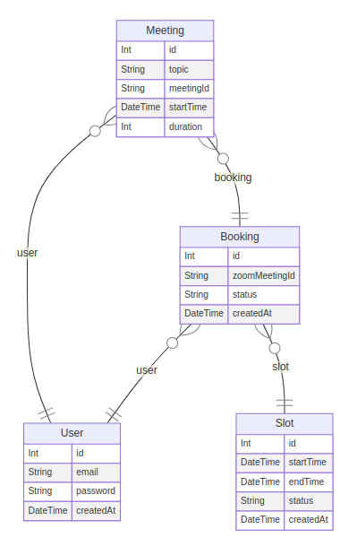
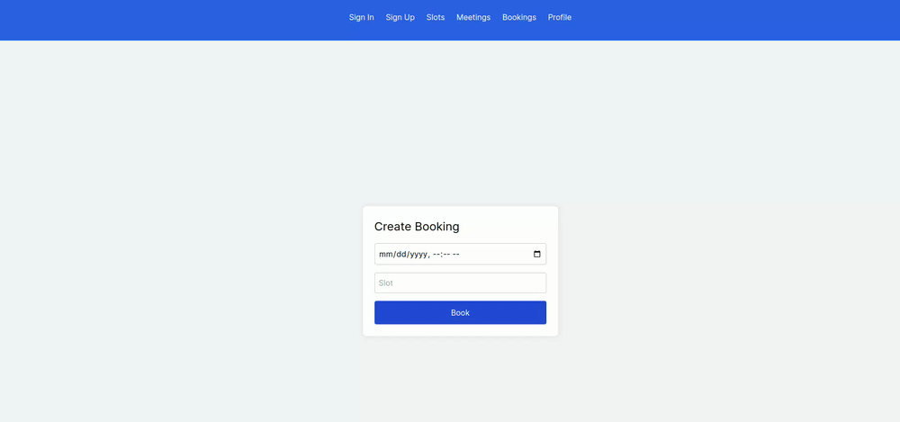

# Booking System

## Table of Contents

1. [Introduction](#introduction)
2. [Database](#database)
3. [JWT](#jwt)
4. [Zoom Integration](#zoom-integration)
5. [Email Notification](#email-notification)
6. [Search Functionality](#search-functionality)
7. [Testing and Postman Documentation](#testing-and-postman-documentation)
8. [Docker Compose](#docker-compose)
9. [CI/CD](#ci-cd)
    - [Vercel](#vercel)
    - [Docker Hub](#docker-hub)
10. [Contributing](#contributing)
11. [License](#license)

## Introduction

    -Book slots easily and efficiently
    -Manage your meetings and bookings
    -Get notified about upcoming events
    -Search and filter available slots
    -Integrate with Zoom for virtual meetings

## Database

## JWT

## Zoom Integration

[Discuss how Zoom integration is implemented, including authentication, meeting creation, and related functionalities.]

## Email Notification

[Detail how email notifications are triggered and managed within the project, including any external services used.]

## Search Functionality

[Explain the search capabilities implemented in the project and how they are integrated into the application.]

## Testing and Postman Documentation

[Describe the testing approach used in the project, including unit tests, integration tests, and API tests. 
### [Postman API Docs](https://documenter.getpostman.com/view/30801951/2sA3duGDif)

## Docker Compose

[Provide instructions or details on how Docker Compose is used to manage development environments or production deployments.]

## CI/CD

### Vercel

[Explain the Continuous Integration and Continuous Deployment (CI/CD) setup using Vercel, including deployment workflows and configurations.]

### Docker Hub

[Describe the Docker Hub integration for containerized deployments, including Dockerfile setup and image management.]

## Simple UI For Some Fuctionality
