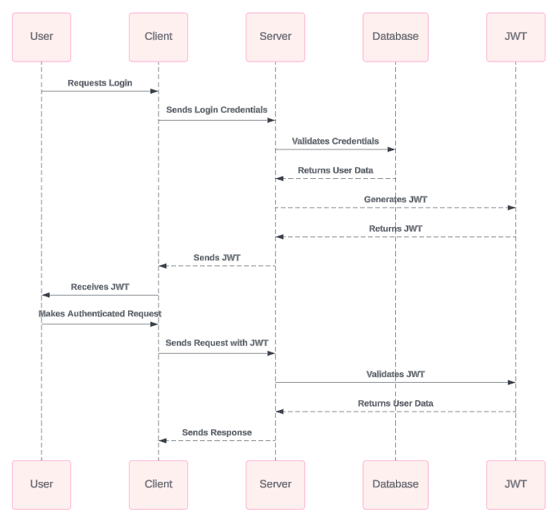
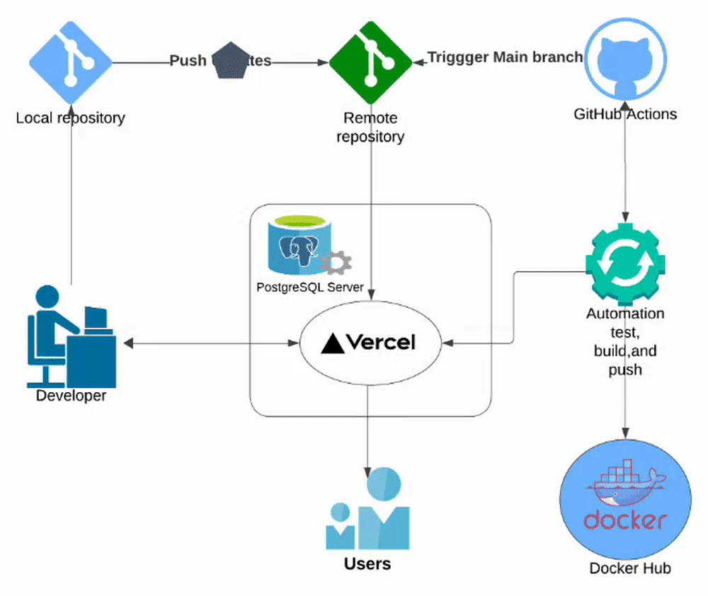

# Booking System

## Table of Contents

1. [Introduction](#introduction)
2. [Database](#database)
3. [JWT Authentication](#jwt-authentication)
4. [Zoom Integration](#zoom-integration)
5. [Email Notification](#email-notification)
6. [Search Functionality](#search-functionality)
7. [Testing and Postman Documentation](#testing-and-postman-documentation)
8. [Docker Compose](#docker-compose)
9. [CI/CD](#ci-cd)
    - [Vercel](#vercel)
    - [Docker Hub](#docker-hub)
10. [Contributing](#contributing)
11. [License](#license)

## Introduction

The Booking System allows users to:
- Book slots easily and efficiently.
- Manage meetings and bookings.
- Receive notifications about upcoming events.
- Search and filter available slots.
- Integrate with Zoom for virtual meetings.

## Database

The system uses PostgreSQL as the database. Below is the Entity-Relationship Diagram (ERD) for the database schema:


## JWT Authentication

### General Overview
JSON Web Tokens (JWT) are used for securely transmitting information between the client and server.


### Sequence Diagram for JWT Process
The following sequence diagram illustrates the JWT authentication flow:



## Zoom Integration

The system integrates with Zoom to schedule virtual meetings. The sequence diagram below shows the Zoom integration process:


## Email Notification

The system sends email notifications to users for booking confirmations and reminders. The diagram below illustrates the email notification flow:


## Search Functionality

The search functionality allows users to filter and find available slots based on their criteria. This feature enhances the user experience by providing quick and efficient slot booking.

## Testing and Postman Documentation

This project uses [Jest](https://jestjs.io/) for testing. The tests include unit tests for endpoints, ensuring that core functionalities work as expected. Jest mocks are used to simulate database interactions, authentication, and email notifications.

### Running Tests

To run the tests, use the following command:

```bash
npm run test
```

### Postman Documentation

Detailed API documentation is available via Postman: [Postman API Docs](https://documenter.getpostman.com/view/30801951/2sA3duGDif)

## Environment Variables

Ensure to set the following environment variables in your `.env` file:

- `DB_USER`: Username for the PostgreSQL database.
- `DB_PASSWORD`: Password for the PostgreSQL database.
- `DB_NAME`: Name of the PostgreSQL database.
- `DB_HOST`: Host address of the PostgreSQL database.
- `ZOOM_CLIENT_ID`: Client ID for the Zoom OAuth application.
- `ZOOM_CLIENT_SECRET`: Client Secret for the Zoom OAuth application.
- `ZOOM_REDIRECT_URI`: Redirect URI for the Zoom OAuth application.
- `EMAIL_CLIENT_ID`: Client ID for the email OAuth application.
- `EMAIL_CLIENT_SECRET`: Client Secret for the email OAuth application.
- `Google_Refresh_Token`: Refresh Token for the Google OAuth application to get new access tokens.
- `EMAIL_USER`: Email address used for sending notifications.
- `POSTGRES_PRISMA_URL`: Connection URL for Prisma to connect to PostgreSQL.
- `POSTGRES_URL_NON_POOLING`: Non-pooling connection URL for PostgreSQL.

## Docker Compose

The project includes a `docker-compose.yml` file for setting up the development environment. Use the following command to build and start the services:

```bash
docker-compose up --build database dev
```

## CI/CD

Continuous Integration and Continuous Deployment (CI/CD) pipelines are configured to ensure smooth deployment processes.


### Vercel

Vercel is used for deploying the  application.


## Simple UI for Some Functionality

Below is a preview of the UI for managing bookings:


## Contributing

Contributions are welcome! Please read the [contributing guidelines](CONTRIBUTING.md) for more information.

## License

This project is licensed under the MIT License - see the [LICENSE](LICENSE) file for details.


